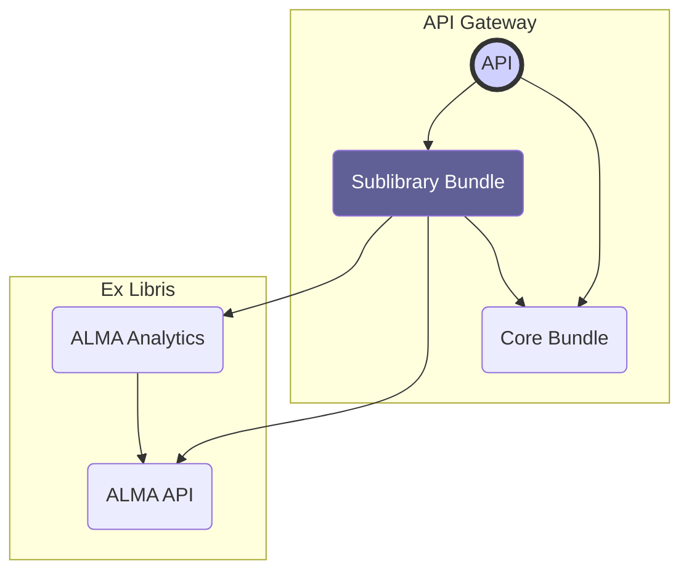

# Overview

Source: https://github.com/digital-blueprint/relay-sublibrary-bundle

The sublibrary bundle provides an API layer for library management tasks on top
of the official ALMA API. It enables multiple sub-organizations to manage their
own library resources (books, holdings, and budgets) independently, while
operating through a single, shared ALMA API key. This approach ensures that each
sub-organization can only access and manage their own resources, maintaining
separation of concerns.

It provides the following features:

* Splitting the library access into separate library units/subsets
* Authorization handling with library management roles per library subset
* Various library management tasks:

    * Assigning of call numbers to books
    * Borrowing books to users
    * Returning books from users
    * Extending the borrowing period of books
    * Showing the available books
    * Showing the current loans
    * Showing the current orders
    * Showing the available budget of the library units

## Documentation

* [Bundle Configuration](./config.md)
* [Authorization](./authz.md)
